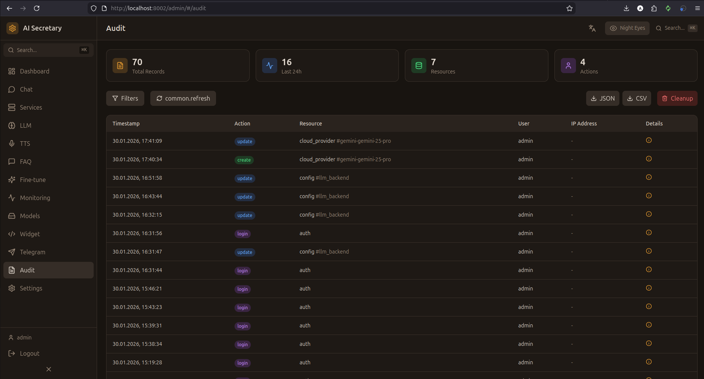

# Audit (Аудит)

Просмотр журнала действий пользователей в системе.

## Скриншот

<!-- Вставьте скриншот страницы Audit -->

## Концепция

Аудит логирует все значимые действия в системе:
- Кто сделал
- Что сделал
- Когда сделал
- С каким результатом

Это важно для безопасности и отладки проблем.

## Журнал событий

### Таблица

| Колонка | Описание |
|---------|----------|
| **Время** | Дата и время события |
| **Пользователь** | Кто выполнил действие |
| **Действие** | Тип действия |
| **Объект** | Над чем выполнено |
| **Результат** | Успех / Ошибка |
| **Детали** | Подробности |

### Фильтры

| Фильтр | Описание |
|--------|----------|
| **Период** | Временной диапазон |
| **Пользователь** | Конкретный пользователь |
| **Действие** | Тип действия |
| **Результат** | Успех / Ошибка / Все |

## Типы событий

### Аутентификация

| Событие | Описание |
|---------|----------|
| `login` | Успешный вход |
| `login_failed` | Неудачная попытка входа |
| `logout` | Выход из системы |
| `token_refresh` | Обновление токена |

### Управление сервисами

| Событие | Описание |
|---------|----------|
| `service_start` | Запуск сервиса |
| `service_stop` | Остановка сервиса |
| `service_restart` | Перезапуск сервиса |

### Настройки LLM

| Событие | Описание |
|---------|----------|
| `llm_backend_change` | Смена бэкенда |
| `persona_change` | Смена персоны |
| `provider_create` | Создание провайдера |
| `provider_update` | Обновление провайдера |
| `provider_delete` | Удаление провайдера |

### TTS настройки

| Событие | Описание |
|---------|----------|
| `voice_change` | Смена голоса |
| `preset_create` | Создание пресета |
| `preset_delete` | Удаление пресета |

### Чат

| Событие | Описание |
|---------|----------|
| `session_create` | Создание сессии |
| `session_delete` | Удаление сессии |
| `bulk_delete` | Массовое удаление |

### Боты и виджеты

| Событие | Описание |
|---------|----------|
| `bot_create` | Создание бота |
| `bot_start` | Запуск бота |
| `bot_stop` | Остановка бота |
| `widget_create` | Создание виджета |

## Экспорт

### Форматы

- **JSON** — полные данные
- **CSV** — для Excel/Google Sheets

### Экспорт

1. Настройте фильтры
2. Нажмите "Экспорт"
3. Выберите формат
4. Скачайте файл

## Хранение

- Логи хранятся в SQLite
- Ротация: 90 дней по умолчанию
- Настраивается в конфигурации

## Уровни доступа

- **Admin** — полный доступ
- **User** — только свои действия

---

← [[Telegram]] | [[Settings]] →
