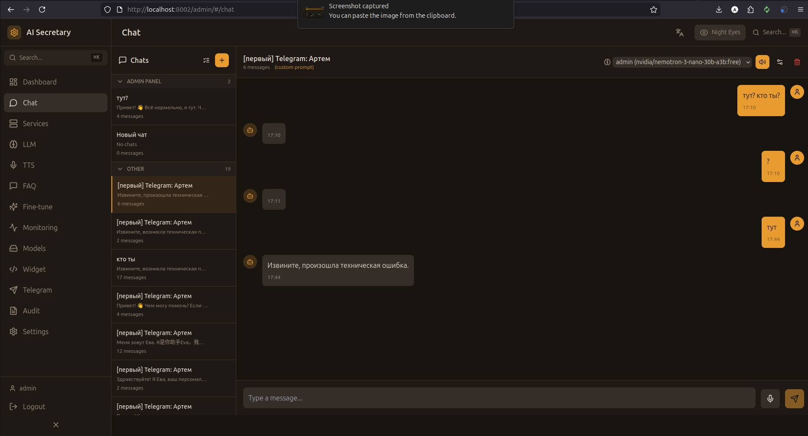

# Chat (Чат)

Полнофункциональный чат с ИИ-ассистентом, поддержкой голосового ввода/вывода и управлением сессиями.

## Скриншот

<!-- Вставьте скриншот страницы Chat -->

## Основные функции

### Чат с ИИ

- **Стриминг ответов** — ответы появляются посимвольно в реальном времени
- **Markdown рендеринг** — поддержка форматирования, кода, списков
- **История сообщений** — сохранение контекста диалога
- **Редактирование сообщений** — изменение отправленных сообщений
- **Регенерация ответов** — повторная генерация ответа ИИ

### Голосовые функции

| Функция | Описание | Кнопка |
|---------|----------|--------|
| **Voice Mode** | Автоматическое озвучивание ответов | 🔊 |
| **TTS** | Ручное озвучивание выбранного ответа | ▶️ |
| **STT** | Голосовой ввод через микрофон | 🎤 |

### Выбор LLM провайдера

В заголовке чата есть выпадающий список для выбора LLM:

- **По умолчанию** — использует системные настройки
- **vLLM** — локальная модель
- **Gemini** — Google Gemini API
- **Cloud providers** — любой настроенный облачный провайдер

Это позволяет тестировать разные модели без изменения глобальных настроек.

## Управление сессиями

### Боковая панель

- **Список чатов** — все сессии с превью последнего сообщения
- **Создание чата** — кнопка "+" создаёт новую сессию
- **Поиск** — фильтрация по названию

### Группировка по источнику

Сессии группируются по источнику создания:

| Группа | Источник |
|--------|----------|
| **Админ-панель** | Чаты из этого интерфейса |
| **Telegram** | Чаты из Telegram ботов |
| **Widget** | Чаты из веб-виджетов |
| **Другие** | Чаты без указанного источника |

### Управление чатами

- **Переименование** — двойной клик по названию → редактирование → Enter
- **Удаление** — иконка корзины на чате
- **Групповое удаление** — режим выбора → отметить несколько → удалить

## Системный промпт

- **Редактирование** — кнопка ⚙️ в заголовке чата
- **Сохранение** — промпт сохраняется для текущей сессии
- **Сброс** — возврат к дефолтному промпту персоны

## Горячие клавиши

| Клавиша | Действие |
|---------|----------|
| `Enter` | Отправить сообщение |
| `Shift+Enter` | Новая строка |
| `Esc` | Отмена редактирования |
| `Ctrl+K` / `⌘K` | Command Palette |

---

← [[Dashboard]] | [[Services]] →
