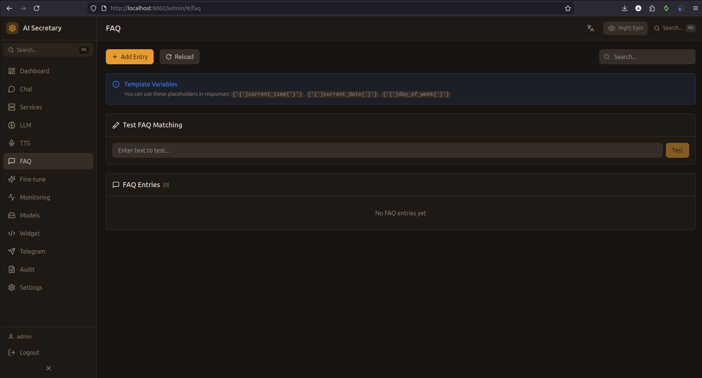

# FAQ (Быстрые ответы)

Управление базой типичных вопросов и ответов для мгновенных ответов без обращения к LLM.

## Скриншот

<!-- Вставьте скриншот страницы FAQ -->


## Концепция

FAQ (Frequently Asked Questions) позволяет настроить мгновенные ответы на типичные вопросы:

1. Пользователь задаёт вопрос
2. Система ищет совпадение в FAQ базе
3. **Если найдено** → мгновенный ответ без LLM
4. **Если не найдено** → запрос к LLM

Это экономит ресурсы и ускоряет ответы на частые вопросы.

## Список FAQ

Таблица со всеми записями:

| Колонка | Описание |
|---------|----------|
| **Вопрос** | Паттерн или точный текст вопроса |
| **Ответ** | Предопределённый ответ |
| **Приоритет** | Порядок проверки (выше = раньше) |
| **Активен** | Включена ли запись |
| **Действия** | Редактировать / Удалить |

## Добавление FAQ

1. Нажмите "Добавить"
2. Введите вопрос (или паттерн)
3. Введите ответ
4. Установите приоритет
5. Нажмите "Сохранить"

### Паттерны вопросов

Поддерживаются:
- **Точное совпадение** — `Как связаться с поддержкой?`
- **Ключевые слова** — `*поддержка*` или `*контакт*`
- **Регулярные выражения** — `/^(как|где) (связаться|найти)/i`

## Редактирование

1. Нажмите иконку редактирования на записи
2. Измените поля
3. Нажмите "Сохранить"

## Тестирование

### Тест FAQ

1. Введите тестовый вопрос
2. Нажмите "Тест"
3. Система покажет:
   - Найденное совпадение (или "не найдено")
   - Ответ FAQ (если найден)
   - Время поиска

## Импорт/Экспорт

### Экспорт

- Нажмите "Экспорт" для скачивания всех FAQ в JSON

### Импорт

1. Нажмите "Импорт"
2. Выберите JSON файл
3. Подтвердите импорт

### Формат JSON

```json
[
  {
    "question": "Как связаться с поддержкой?",
    "answer": "Напишите на support@example.com",
    "priority": 100,
    "enabled": true
  }
]
```

## Перезагрузка

Кнопка "Перезагрузить" обновляет FAQ базу из БД без перезапуска сервиса.

---

← [[TTS]] | [[Finetune]] →
