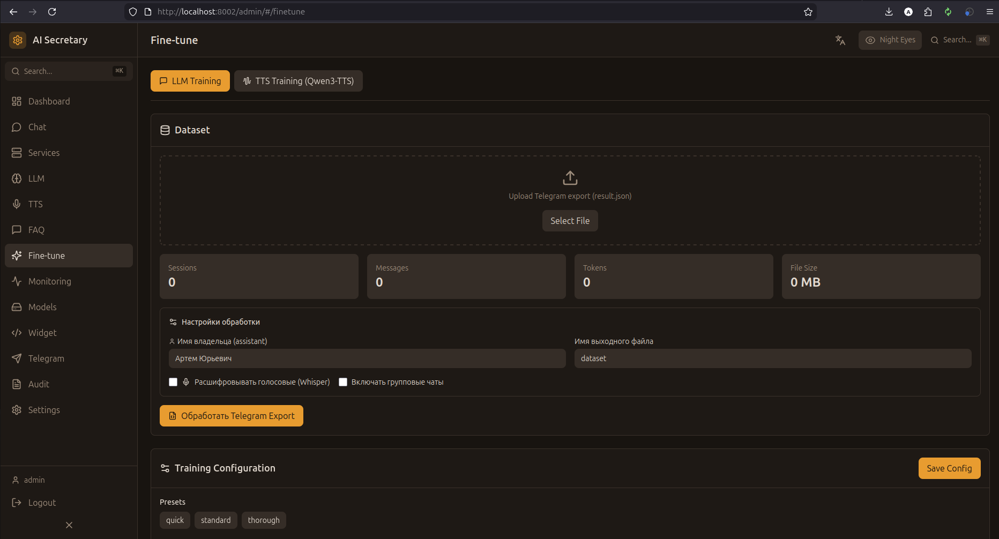

# Finetune (Дообучение)

Дообучение языковых моделей на собственных данных с использованием LoRA адаптеров.

## Скриншот

<!-- Вставьте скриншот страницы Finetune -->


## Концепция

**Fine-tuning (дообучение)** позволяет адаптировать базовую модель под специфические задачи:
- Стиль общения вашей компании
- Специализированная терминология
- Типичные сценарии диалогов

Используется **LoRA (Low-Rank Adaptation)** — эффективный метод, требующий меньше ресурсов.

## Подготовка данных

### Формат датасета

JSON файл с диалогами:

```json
[
  {
    "instruction": "Расскажи о наших услугах",
    "input": "",
    "output": "Мы предоставляем услуги консалтинга..."
  },
  {
    "instruction": "Сколько стоит консультация?",
    "input": "",
    "output": "Стоимость консультации от 5000 рублей..."
  }
]
```

### Загрузка датасета

1. Нажмите "Загрузить датасет"
2. Выберите JSON файл
3. Система валидирует формат
4. Показывается превью данных

## Параметры обучения

| Параметр | Описание | По умолчанию |
|----------|----------|--------------|
| **Epochs** | Количество эпох | 3 |
| **Learning Rate** | Скорость обучения | 2e-4 |
| **Batch Size** | Размер батча | 4 |
| **LoRA Rank** | Ранг LoRA | 8 |
| **LoRA Alpha** | Alpha параметр | 16 |
| **Target Modules** | Модули для обучения | q_proj, v_proj |

## Процесс обучения

### Запуск

1. Загрузите датасет
2. Настройте параметры
3. Нажмите "Начать обучение"

### Мониторинг

- **Прогресс** — процент завершения
- **Loss** — график функции потерь
- **Время** — оставшееся время
- **Логи** — детальные логи обучения

### Остановка

Кнопка "Остановить" прерывает обучение с сохранением текущего чекпоинта.

## LoRA адаптеры

### Список адаптеров

Таблица обученных адаптеров:
- **Название** — имя адаптера
- **Базовая модель** — на какой модели обучен
- **Датасет** — использованный датасет
- **Дата** — когда обучен
- **Размер** — размер файлов

### Управление

| Действие | Описание |
|----------|----------|
| **Загрузить** | Активировать адаптер |
| **Выгрузить** | Деактивировать адаптер |
| **Удалить** | Удалить адаптер |
| **Скачать** | Экспортировать адаптер |

## Требования

- **GPU** — минимум 12GB VRAM
- **Время** — 1-4 часа на 1000 примеров
- **Место** — ~500MB на адаптер

---

← [[FAQ]] | [[Monitoring]] →
