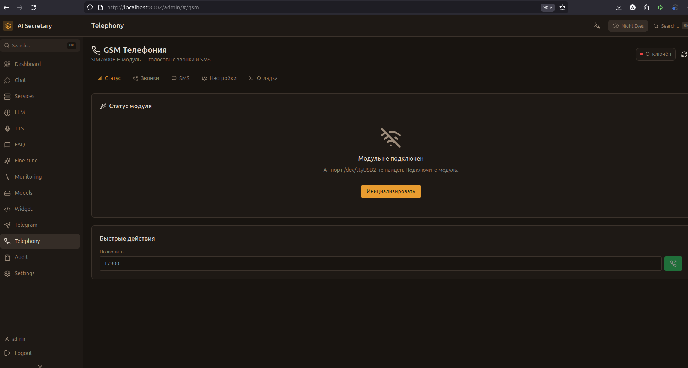

# GSM Телефония

Управление GSM модулем SIM7600E-H для голосовых звонков и SMS.

## Скриншот

<!-- Вставьте скриншот страницы GSM -->


## Концепция

Система поддерживает GSM телефонию через модуль SIM7600E-H:
- Приём входящих голосовых звонков
- Автоответчик с ИИ
- Отправка и приём SMS
- Уведомления о пропущенных звонках

### Архитектура

```
Входящий звонок → GSM модуль → STT → LLM → TTS → GSM модуль → Абонент
                     ↓
              SMS уведомления
```

## Вкладки

### Статус

Информация о GSM модуле:

| Параметр | Описание |
|----------|----------|
| **Состояние** | Disconnected / Initializing / Ready / In Call |
| **Сигнал** | Уровень сигнала (0-100%) |
| **SIM** | Статус SIM-карты (Ready / PIN / PUK) |
| **Сеть** | Имя оператора, регистрация |
| **Номер** | Номер телефона SIM |

#### Быстрые действия

| Кнопка | Описание |
|--------|----------|
| 🔌 **Инициализировать** | Подключиться к модулю |
| 📞 **Ответить** | Принять входящий звонок |
| 📴 **Завершить** | Завершить текущий звонок |

### Звонки

История звонков:

| Колонка | Описание |
|---------|----------|
| **Направление** | Входящий / Исходящий |
| **Номер** | Номер абонента |
| **Статус** | Completed / Missed / Failed |
| **Начало** | Время начала |
| **Длительность** | Продолжительность звонка |
| **Превью** | Краткое содержание разговора |

### SMS

#### Отправка SMS

| Поле | Описание |
|------|----------|
| **Номер** | Номер получателя (+7...) |
| **Текст** | Текст сообщения (до 160 символов) |

#### История сообщений

| Колонка | Описание |
|---------|----------|
| **Направление** | Входящее / Исходящее |
| **Номер** | Номер абонента |
| **Текст** | Содержимое |
| **Время** | Дата и время |
| **Статус** | Delivered / Pending / Failed |

### Настройки

#### Порты

| Параметр | Описание | По умолчанию |
|----------|----------|--------------|
| **AT порт** | Порт для AT команд | `/dev/ttyUSB2` |
| **Аудио порт** | Порт для PCM аудио | `/dev/ttyUSB4` |
| **Baud rate** | Скорость порта | 115200 |

#### Автоответ

| Параметр | Описание |
|----------|----------|
| **Автоответ** | Включить автоматический ответ |
| **Гудков до ответа** | Количество гудков |
| **Приветствие** | Текст приветствия |
| **Прощание** | Текст прощания |
| **Занято** | Сообщение при занятости |

#### Фильтрация номеров

| Параметр | Описание |
|----------|----------|
| **Белый список** | Разрешённые номера (если пуст — все) |
| **Чёрный список** | Заблокированные номера |

#### SMS уведомления

| Параметр | Описание |
|----------|----------|
| **Включить** | Отправлять SMS уведомления |
| **Номер для уведомлений** | Куда отправлять |
| **Шаблон пропущенного** | Текст при пропущенном звонке |
| **Шаблон голосового** | Текст при голосовом сообщении |

#### Таймауты

| Параметр | Описание | По умолчанию |
|----------|----------|--------------|
| **Тишина** | Таймаут тишины (сек) | 5 |
| **Макс. длительность** | Максимум звонка (сек) | 300 |

#### LLM / TTS

| Параметр | Описание |
|----------|----------|
| **LLM Backend** | vLLM / Gemini / Cloud |
| **Персона** | Выбор персоны |
| **Голос TTS** | Голос для ответов |
| **Пресет TTS** | Настройки синтеза |

### Отладка

Консоль для отправки AT команд напрямую в модуль.

#### Быстрые команды

| Команда | Описание |
|---------|----------|
| `AT` | Проверка связи |
| `ATI` | Информация о модуле |
| `AT+CSQ` | Уровень сигнала |
| `AT+CPIN?` | Статус SIM |
| `AT+COPS?` | Текущий оператор |
| `AT+CNUM` | Номер телефона |

#### Доступные порты

Список обнаруженных serial портов:
- `/dev/ttyUSB*` — USB serial
- `/dev/ttyACM*` — ACM модемы

## Оборудование

### SIM7600E-H

| Характеристика | Значение |
|----------------|----------|
| **Сети** | 4G LTE, 3G, 2G |
| **Голос** | VoLTE, CS Voice |
| **SMS** | Text, PDU |
| **Интерфейс** | USB, UART |
| **Питание** | 5V, 2A |

### Подключение

```
SIM7600E-H          Компьютер
    USB  ─────────── USB порт

После подключения появятся порты:
/dev/ttyUSB0 - Diagnostic
/dev/ttyUSB1 - GPS NMEA
/dev/ttyUSB2 - AT Commands  ← Используем
/dev/ttyUSB3 - Modem
/dev/ttyUSB4 - Audio PCM    ← Используем
```

### Требования

- USB кабель
- SIM-карта с активным тарифом
- Антенна (LTE + GPS опционально)
- Питание 5V 2A (через USB или внешнее)

## API Endpoints

| Метод | Endpoint | Описание |
|-------|----------|----------|
| GET | `/admin/gsm/status` | Статус модуля |
| POST | `/admin/gsm/initialize` | Инициализация |
| GET | `/admin/gsm/config` | Получить конфиг |
| PUT | `/admin/gsm/config` | Обновить конфиг |
| GET | `/admin/gsm/calls` | Список звонков |
| GET | `/admin/gsm/calls/active` | Активный звонок |
| POST | `/admin/gsm/calls/answer` | Ответить |
| POST | `/admin/gsm/calls/hangup` | Завершить |
| POST | `/admin/gsm/calls/dial` | Позвонить |
| GET | `/admin/gsm/sms` | Список SMS |
| POST | `/admin/gsm/sms` | Отправить SMS |
| POST | `/admin/gsm/at` | AT команда |
| GET | `/admin/gsm/ports` | Список портов |

## Статусы

### Модуль

| Статус | Описание |
|--------|----------|
| `disconnected` | Модуль не подключен |
| `initializing` | Инициализация |
| `ready` | Готов к работе |
| `incoming_call` | Входящий звонок |
| `in_call` | Разговор |
| `error` | Ошибка |

### Звонки

| Статус | Описание |
|--------|----------|
| `ringing` | Звонит |
| `active` | Разговор |
| `completed` | Завершён |
| `missed` | Пропущен |
| `failed` | Ошибка |

---

← [[Telegram]] | [[Audit]] →
