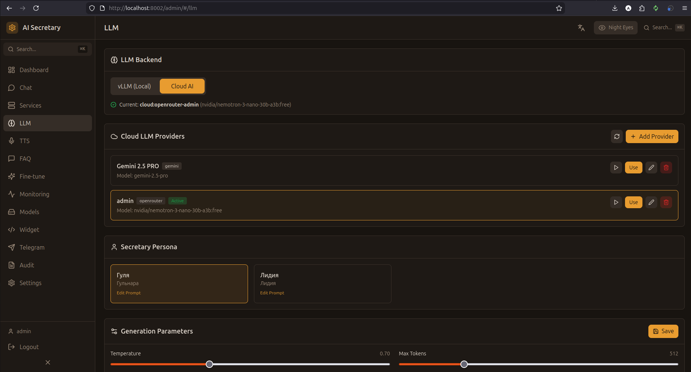

# LLM (Языковые модели)

Настройка языковых моделей, персон, параметров генерации и облачных провайдеров.

## Скриншот

<!-- Вставьте скриншот страницы LLM -->

## Выбор бэкенда

### Доступные бэкенды

| Бэкенд | Описание | Требования |
|--------|----------|------------|
| **vLLM** | Локальная модель | GPU 12GB+ |
| **Cloud AI** | Облачные провайдеры | API ключ |

### Переключение бэкенда

1. Выберите бэкенд из выпадающего списка
2. При выборе Cloud AI — выберите конкретного провайдера
3. Нажмите "Применить"

## Персоны

Система поддерживает несколько персон (личностей) ИИ-ассистента:

| Персона | Имя | Описание |
|---------|-----|----------|
| **gulya** | Гуля | Дружелюбная секретарь |
| **lidia** | Лидия | Профессиональный ассистент |

### Выбор персоны

- Выберите персону из списка
- Каждая персона имеет свой системный промпт
- Можно редактировать промпт для каждой персоны

## Параметры генерации

| Параметр | Описание | Диапазон | По умолчанию |
|----------|----------|----------|--------------|
| **Temperature** | Креативность ответов | 0.0 - 2.0 | 0.7 |
| **Max Tokens** | Макс. длина ответа | 1 - 4096 | 2048 |
| **Top P** | Nucleus sampling | 0.0 - 1.0 | 0.9 |
| **Repetition Penalty** | Штраф за повторы | 1.0 - 2.0 | 1.1 |

## Облачные провайдеры

### Настроенные провайдеры

Список всех добавленных облачных LLM провайдеров:
- Статус (включен/выключен)
- Провайдер по умолчанию (⭐)
- Кнопки: Тест / Редактировать / Удалить

### Добавление провайдера

1. Нажмите "Добавить провайдер"
2. Выберите тип провайдера
3. Введите API ключ
4. Выберите модель
5. (Опционально) Настройте VLESS прокси для Gemini
6. Нажмите "Сохранить"

### Поддерживаемые провайдеры

| Провайдер | Бесплатные модели | Платные модели |
|-----------|-------------------|----------------|
| **OpenRouter** | nemotron-3-nano, trinity-large, solar-pro-3 | gemini-2.0-flash, gpt-4o-mini |
| **Google Gemini** | — | gemini-2.0-flash, gemini-2.5-pro |
| **OpenAI** | — | gpt-4o, gpt-4o-mini |
| **Anthropic** | — | claude-opus-4-5, claude-sonnet-4 |
| **DeepSeek** | — | deepseek-chat, deepseek-coder |
| **Kimi** | — | kimi-k2, moonshot-v1-128k |

### VLESS прокси для Gemini

Для регионов с ограниченным доступом к Google API:

1. В модальном окне провайдера найдите секцию "VLESS Proxy"
2. Вставьте VLESS URL
3. Нажмите "Тест прокси" для проверки
4. Сохраните — все запросы к Gemini пойдут через прокси

Подробнее: [[VLESS-Proxy]]

## Системный промпт

### Редактирование

1. Выберите персону
2. Отредактируйте промпт в текстовом поле
3. Нажмите "Сохранить"

### Сброс

Кнопка "Сбросить" возвращает промпт к значению по умолчанию для выбранной персоны.

---

← [[Services]] | [[TTS]] →
