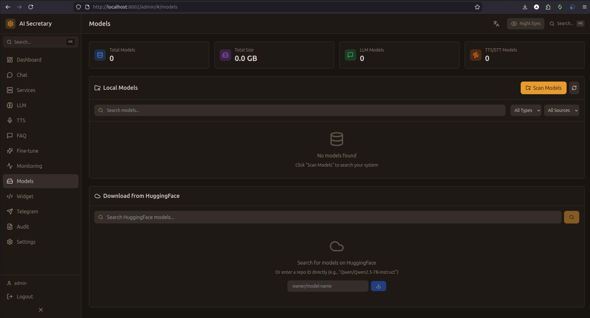

# Models (Модели)

Управление скачанными моделями из HuggingFace Hub.

## Скриншот

<!-- Вставьте скриншот страницы Models -->

## Список моделей

### Доступные модели

Таблица всех моделей в системе:

| Колонка | Описание |
|---------|----------|
| **Название** | Имя модели |
| **Тип** | LLM / TTS / STT |
| **Размер** | Размер на диске |
| **Формат** | GPTQ / AWQ / FP16 / ONNX |
| **Статус** | Загружена / Не загружена |

### Фильтры

- **По типу** — LLM, TTS, STT, LoRA
- **По статусу** — Загруженные / Все
- **Поиск** — по названию

## LLM модели

### Поддерживаемые модели

| Модель | Размер | Формат | VRAM |
|--------|--------|--------|------|
| Qwen2.5-7B-Instruct | 7B | FP16 | 14GB |
| Qwen2.5-7B-Instruct-GPTQ | 7B | GPTQ-Int4 | 6GB |
| Llama-3.1-8B-Instruct | 8B | FP16 | 16GB |
| Llama-3.1-8B-Instruct-GPTQ | 8B | GPTQ-Int4 | 8GB |
| DeepSeek-7B-Chat | 7B | FP16 | 14GB |

### Загрузка модели

1. Нажмите "Скачать модель"
2. Введите HuggingFace ID (например: `Qwen/Qwen2.5-7B-Instruct-GPTQ-Int4`)
3. Выберите папку назначения
4. Нажмите "Скачать"

### Прогресс загрузки

- Отображается прогресс-бар
- Скорость скачивания
- Оставшееся время
- Возможность отмены

## TTS модели

### XTTS v2

- Автоматически скачивается при первом использовании
- Размер: ~2GB
- Расположение: `~/.cache/tts_models/`

### Piper модели

| Модель | Голос | Размер |
|--------|-------|--------|
| ru_RU-dmitri-medium | Дмитрий | ~60MB |
| ru_RU-irina-medium | Ирина | ~60MB |

## STT модели

### Vosk

| Модель | Язык | Размер |
|--------|------|--------|
| vosk-model-ru-0.42 | Русский | ~1.5GB |
| vosk-model-small-ru | Русский (мини) | ~45MB |

### Whisper

Модели Whisper скачиваются автоматически через библиотеку.

## Управление

### Удаление модели

1. Выберите модель
2. Нажмите "Удалить"
3. Подтвердите удаление

⚠️ **Внимание:** Удаление необратимо!

### Перемещение

Модели можно переместить в другую директорию через настройки.

## Пути хранения

| Тип | Путь по умолчанию |
|-----|-------------------|
| LLM | `./models/llm/` |
| TTS | `./models/tts/` или `~/.cache/tts_models/` |
| STT | `./models/vosk/` |
| LoRA | `./models/lora/` |
| Piper | `./models/piper/` |

---

← [[Monitoring]] | [[Widget]] →
