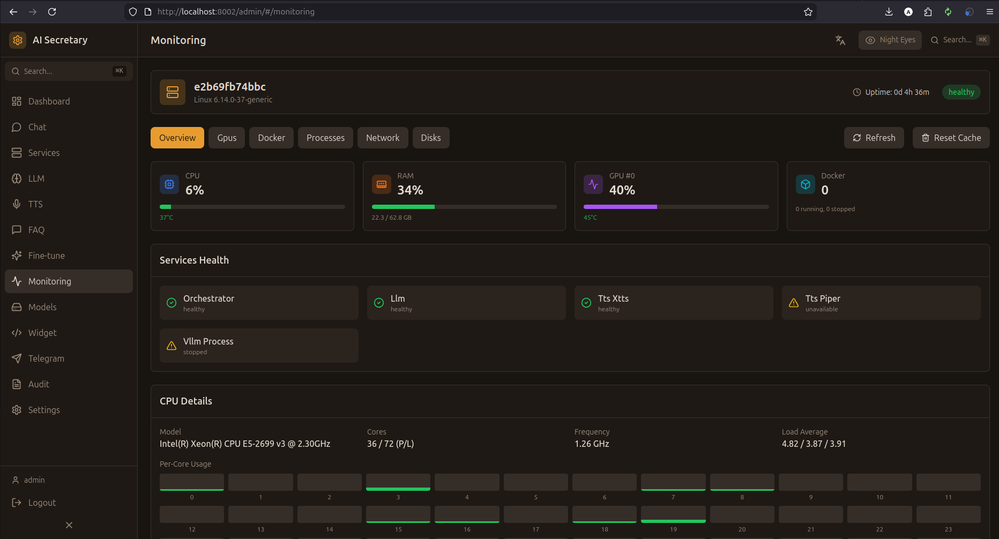

# Monitoring (Мониторинг)

Мониторинг ресурсов системы, GPU метрик и просмотр логов.

## Скриншот

<!-- Вставьте скриншот страницы Monitoring -->

## GPU метрики

### Графики реального времени

| Метрика | Описание |
|---------|----------|
| **GPU Utilization** | Загрузка GPU (%) |
| **VRAM Usage** | Использование видеопамяти |
| **Temperature** | Температура GPU (°C) |
| **Power Draw** | Потребление энергии (W) |

Графики строятся на Chart.js с историей за последние 5 минут.

### Детальная информация

- **GPU модель** — название видеокарты
- **Driver version** — версия драйвера NVIDIA
- **CUDA version** — версия CUDA
- **Compute capability** — вычислительные возможности

## CPU метрики

| Метрика | Описание |
|---------|----------|
| **CPU Usage** | Загрузка процессора (%) |
| **RAM Usage** | Использование оперативной памяти |
| **Disk Usage** | Использование диска |

## Системные логи

### Фильтры

| Фильтр | Описание |
|--------|----------|
| **Level** | INFO / WARNING / ERROR / DEBUG |
| **Service** | Orchestrator / vLLM / TTS / STT |
| **Time range** | Временной диапазон |

### Просмотр

- Логи отображаются в реальном времени через SSE
- Цветовая кодировка по уровню важности
- Поиск по тексту
- Экспорт в файл

## Health Check

### Статусы сервисов

| Сервис | Проверка |
|--------|----------|
| **Orchestrator** | HTTP `/health` |
| **vLLM** | HTTP `/health` на порту vLLM |
| **Redis** | Ping команда |
| **Database** | SELECT 1 |

### Алерты

- **Высокая температура GPU** — > 85°C
- **Мало VRAM** — < 10% свободно
- **Сервис недоступен** — health check fail

## SSE vs Polling

Система использует Server-Sent Events для обновлений в реальном времени:
- **SSE доступен** — обновления мгновенные
- **SSE недоступен** — fallback на polling каждые 5 секунд

---

← [[Finetune]] | [[Models]] →
