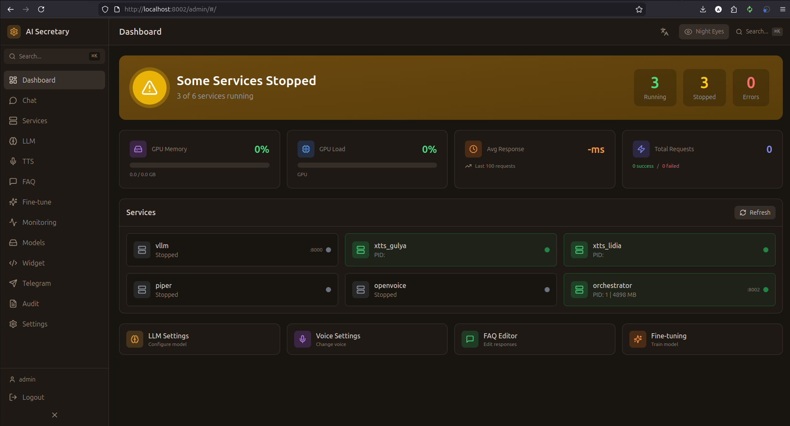

# Wiki Pages - Инструкция по загрузке

Эта папка содержит подготовленные страницы для GitHub Wiki.

## Структура файлов

```
wiki-pages/
├── Home.md              # Главная страница
├── _Sidebar.md          # Боковое меню
├── Dashboard.md         # Вкладка Dashboard
├── Chat.md              # Вкладка Chat
├── Services.md          # Вкладка Services
├── LLM.md               # Вкладка LLM
├── TTS.md               # Вкладка TTS
├── FAQ.md               # Вкладка FAQ
├── Finetune.md          # Вкладка Finetune
├── Monitoring.md        # Вкладка Monitoring
├── Models.md            # Вкладка Models
├── Widget.md            # Вкладка Widget
├── Telegram.md          # Вкладка Telegram
├── Audit.md             # Вкладка Audit
├── Settings.md          # Вкладка Settings
├── Cloud-LLM-Providers.md
├── VLESS-Proxy.md
└── README.md            # Эта инструкция
```

## Как загрузить в GitHub Wiki

### Способ 1: Через веб-интерфейс

1. Перейдите на https://github.com/ShaerWare/AI_Secretary_System/wiki
2. Нажмите "Create the first page"
3. Вставьте содержимое `Home.md`
4. Сохраните
5. Для каждой следующей страницы:
   - Нажмите "New Page"
   - Введите название (без .md)
   - Вставьте содержимое
   - Сохраните

### Способ 2: Через Git (рекомендуется)

После создания первой страницы через веб:

```bash
# Клонировать wiki репозиторий
git clone https://github.com/ShaerWare/AI_Secretary_System.wiki.git
cd AI_Secretary_System.wiki

# Скопировать все файлы
cp ../AI_Secretary_System/wiki-pages/*.md .

# Создать папку для изображений
mkdir -p images

# Закоммитить и запушить
git add .
git commit -m "Add wiki documentation"
git push
```

## Добавление скриншотов

1. Сделайте скриншоты каждой вкладки админки
2. Сохраните их в папку `images/` с именами:
   - `dashboard.png`
   - `chat.png`
   - `services.png`
   - `llm.png`
   - `tts.png`
   - `faq.png`
   - `finetune.png`
   - `monitoring.png`
   - `models.png`
   - `widget.png`
   - `telegram.png`
   - `audit.png`
   - `settings.png`

3. Загрузите в wiki репозиторий:
```bash
cd AI_Secretary_System.wiki
git add images/
git commit -m "Add screenshots"
git push
```

## Placeholder'ы для скриншотов

В каждом файле есть строка вида:
```markdown
<!-- Вставьте скриншот страницы Dashboard -->

```

После загрузки скриншотов они автоматически отобразятся.

## Рекомендации по скриншотам

- Разрешение: 1280x800 или выше
- Формат: PNG
- Показывайте всю страницу, включая sidebar
- Используйте тему Light для лучшей читаемости
- Скройте личные данные (API ключи, токены)
