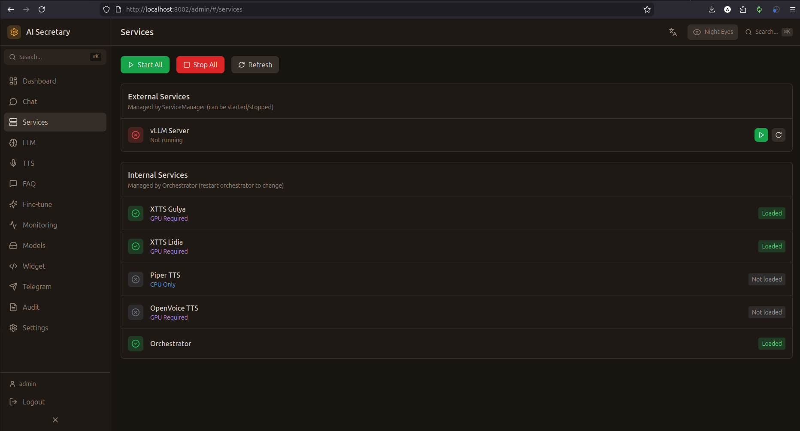

# Services (Сервисы)

Управление фоновыми сервисами системы, в первую очередь vLLM.

## Скриншот

<!-- Вставьте скриншот страницы Services -->

## vLLM сервис

### Статус

Карточка отображает:
- **Состояние** — Running / Stopped / Starting
- **Модель** — текущая загруженная модель
- **GPU память** — использование VRAM
- **Uptime** — время работы

### Управление

| Кнопка | Действие |
|--------|----------|
| ▶️ **Start** | Запустить vLLM сервер |
| ⏹️ **Stop** | Остановить vLLM сервер |
| 🔄 **Restart** | Перезапустить сервер |

### Docker управление

Если vLLM запущен в Docker контейнере:
- **Pull image** — скачать последний образ `vllm/vllm-openai`
- **Container logs** — просмотр логов контейнера
- **Auto-start** — автоматический запуск при старте системы

## Логи в реальном времени

Окно логов отображает:
- **Статус запуска** — загрузка модели, инициализация
- **Запросы** — входящие запросы к LLM
- **Ошибки** — проблемы и предупреждения

Логи обновляются через SSE (Server-Sent Events) в реальном времени.

### Фильтры логов

- **INFO** — информационные сообщения
- **WARNING** — предупреждения
- **ERROR** — ошибки
- **DEBUG** — отладочная информация

## Конфигурация vLLM

| Параметр | Описание | Значение по умолчанию |
|----------|----------|----------------------|
| `VLLM_API_URL` | URL API сервера | `http://localhost:11434` |
| `VLLM_MODEL_NAME` | Имя модели/LoRA | `lydia` |
| `CUDA_VISIBLE_DEVICES` | GPU для использования | `0` |
| `GPU_MEMORY_UTILIZATION` | Лимит VRAM | `0.5` (50%) |

## Поддерживаемые модели

| Модель | Размер | VRAM | Скорость |
|--------|--------|------|----------|
| Qwen2.5-7B + LoRA | 7B | ~6GB | Быстро |
| Llama-3.1-8B GPTQ | 8B | ~8GB | Быстро |
| DeepSeek-7B | 7B | ~7GB | Средне |

---

← [[Chat]] | [[LLM]] →
