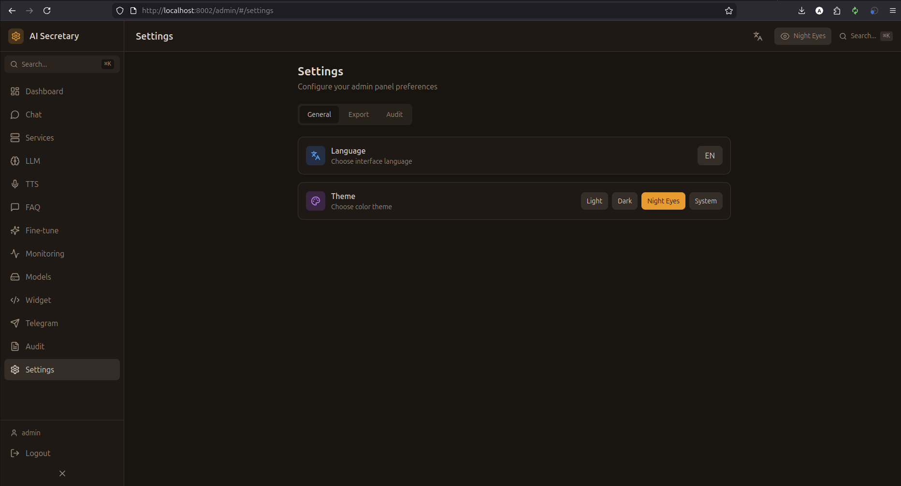

# Settings (Настройки)

Общие настройки системы, темы, язык и управление данными.

## Скриншот

<!-- Вставьте скриншот страницы Settings -->

## Интерфейс

### Язык

| Язык | Код |
|------|-----|
| Русский | `ru` |
| English | `en` |

Переключение мгновенное, без перезагрузки.

### Тема

| Тема | Описание |
|------|----------|
| **Light** | Светлая тема |
| **Dark** | Тёмная тема |
| **Night Eyes** | Тёплая тёмная (для глаз) |

Тема сохраняется в localStorage.

## Безопасность

### Смена пароля

1. Введите текущий пароль
2. Введите новый пароль
3. Подтвердите новый пароль
4. Нажмите "Изменить"

### Сессии

- Просмотр активных сессий
- Завершение других сессий
- Время жизни токена

## Резервное копирование

### Экспорт конфигурации

Экспортирует:
- Настройки LLM
- Персоны и промпты
- FAQ записи
- TTS пресеты
- Настройки ботов
- Настройки виджетов

**Формат:** JSON

### Импорт конфигурации

1. Нажмите "Импорт"
2. Выберите JSON файл
3. Выберите что импортировать
4. Подтвердите

⚠️ **Внимание:** Импорт перезаписывает существующие данные!

### Сброс к заводским

Удаляет все настройки и возвращает значения по умолчанию.

## Системная информация

| Параметр | Описание |
|----------|----------|
| **Версия** | Версия системы |
| **Python** | Версия Python |
| **CUDA** | Версия CUDA |
| **Uptime** | Время работы |
| **Database** | Размер БД |

## Переменные окружения

Обзор текущих переменных:

| Переменная | Значение |
|------------|----------|
| `LLM_BACKEND` | Текущий бэкенд |
| `ORCHESTRATOR_PORT` | Порт сервера |
| `CUDA_VISIBLE_DEVICES` | Используемые GPU |

⚠️ Изменение переменных требует перезапуска.

## Логирование

### Уровень логов

| Уровень | Описание |
|---------|----------|
| **DEBUG** | Все сообщения |
| **INFO** | Информационные |
| **WARNING** | Предупреждения |
| **ERROR** | Только ошибки |

### Ротация логов

- **Размер** — максимальный размер файла
- **Количество** — сколько файлов хранить
- **Путь** — директория логов

## О программе

- **Версия:** 1.0.0
- **Лицензия:** MIT
- **GitHub:** [ShaerWare/AI_Secretary_System](https://github.com/ShaerWare/AI_Secretary_System)
- **Документация:** [Wiki](https://github.com/ShaerWare/AI_Secretary_System/wiki)

---

← [[Audit]] | [[Home]]
