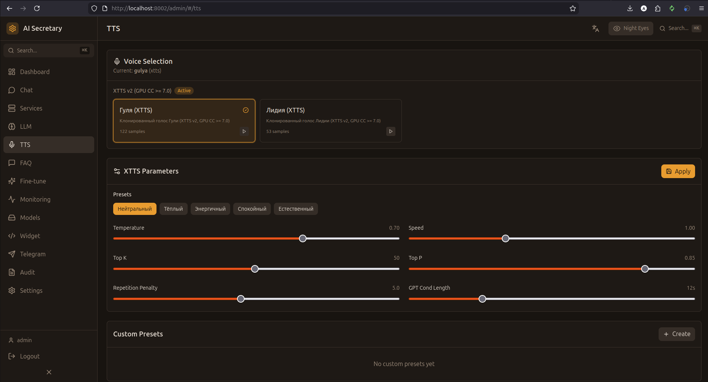

# TTS (Синтез речи)

Настройка голосов, параметров синтеза и тестирование TTS.

## Скриншот

<!-- Вставьте скриншот страницы TTS -->


## Доступные голоса

### XTTS v2 (GPU)

Высококачественное клонирование голоса на GPU:

| Голос | Описание | Требования |
|-------|----------|------------|
| **Анна** | Женский голос, дружелюбный | CUDA GPU |
| **Марина** | Женский голос, профессиональный | CUDA GPU |

### Piper TTS (CPU)

Быстрый синтез на CPU с предобученными голосами:

| Голос | Описание | Язык |
|-------|----------|------|
| **Дмитрий** | Мужской голос, medium quality | Русский |
| **Ирина** | Женский голос, medium quality | Русский |

## Выбор голоса

1. Выберите движок (XTTS или Piper)
2. Выберите голос из списка
3. Нажмите "Применить"

Текущий голос отображается в заголовке секции.

## Параметры XTTS

| Параметр | Описание | Диапазон | По умолчанию |
|----------|----------|----------|--------------|
| **Speed** | Скорость речи | 0.5 - 2.0 | 1.0 |
| **Temperature** | Вариативность | 0.1 - 1.0 | 0.7 |
| **Top K** | Sampling | 1 - 100 | 50 |
| **Top P** | Nucleus sampling | 0.0 - 1.0 | 0.85 |
| **Repetition Penalty** | Штраф за повторы | 1.0 - 2.0 | 1.0 |
| **Length Penalty** | Штраф за длину | 0.5 - 2.0 | 1.0 |

## Пресеты

### Создание пресета

1. Настройте параметры
2. Нажмите "Сохранить как пресет"
3. Введите название
4. Пресет появится в списке

### Управление пресетами

- **Загрузить** — применить параметры пресета
- **Обновить** — сохранить текущие параметры в пресет
- **Удалить** — удалить пресет

### Встроенные пресеты

| Пресет | Описание |
|--------|----------|
| **Default** | Сбалансированные настройки |
| **Fast** | Быстрый синтез, меньше качество |
| **Quality** | Высокое качество, медленнее |
| **Expressive** | Эмоциональная речь |

## Тестирование

### Тест синтеза

1. Введите текст в поле
2. Нажмите "Синтезировать"
3. Прослушайте результат
4. Скачайте аудио при необходимости

### Кэширование

- **Статус кэша** — показывает количество закэшированных фраз
- **Очистить кэш** — удалить все закэшированные аудио
- Кэширование ускоряет повторный синтез одинаковых фраз

## Стриминг TTS

Для телефонии и реального времени доступны стриминговые эндпоинты:

```
POST /admin/tts/stream  — HTTP chunked streaming
WS /admin/tts/ws/stream — WebSocket streaming
```

Целевая задержка: <500ms до первого аудио.

---

← [[LLM]] | [[FAQ]] →
