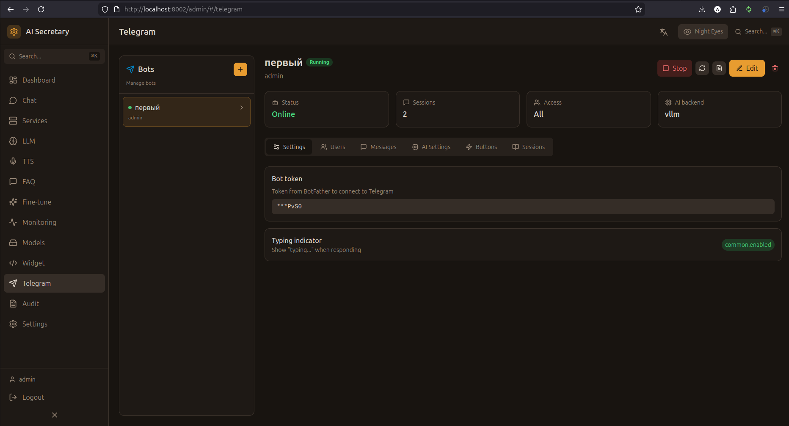

# Telegram (Боты)

Управление мультиинстансными Telegram ботами с независимыми настройками AI, TTS, воронкой продаж и платежами.

## Скриншот

<!-- Вставьте скриншот страницы Telegram -->


## Концепция

Система поддерживает **несколько Telegram ботов одновременно**. Каждый бот:
- Запускается как **отдельный субпроцесс** Python
- Имеет независимый LLM бэкенд, персону и системный промпт
- Может иметь свою воронку продаж (квиз, сегменты, агентские промпты)
- Поддерживает **кнопки действий** с переопределением AI-настроек
- Принимает платежи (Telegram Stars, YooKassa, YooMoney)
- Управляется (start/stop/restart) из админ-панели

## Список ботов

Левая панель отображает все инстансы:

| Элемент | Описание |
|---------|----------|
| **Индикатор** | Зелёный = запущен, серый = остановлен |
| **Название** | Имя бота |
| **Enabled** | Включён ли бот |
| **Действия** | Start / Stop / Restart / Delete |

## Создание бота

### Шаг 1: Создание в BotFather

1. Откройте [@BotFather](https://t.me/BotFather) в Telegram
2. Отправьте `/newbot`
3. Введите имя и username
4. Скопируйте токен (формат: `123456:ABC-DEF...`)

### Шаг 2: Добавление в систему

1. Нажмите **"Добавить бота"** в админ-панели
2. Введите название и вставьте токен
3. Настройте параметры (см. ниже)
4. Нажмите **"Сохранить"**

Из названия автоматически генерируется slug-ID (например, `"Sales Bot"` → `sales-bot`).

## Настройки бота

Конфигурация организована по вкладкам:

### Основные (Settings)

| Параметр | Описание |
|----------|----------|
| **Название** | Отображаемое имя инстанса |
| **Токен** | Bot API токен (маскируется: `***1234`) |
| **API URL** | Опциональный tunnel/proxy URL для Telegram API |
| **Описание** | Описание бота |
| **Enabled** | Включить/отключить бот |

### Пользователи (Users)

| Параметр | Описание |
|----------|----------|
| **Allowed Users** | JSON-массив Telegram User IDs (пустой = все допущены) |
| **Admin Users** | JSON-массив User IDs с правами администратора бота |

### Сообщения (Messages)

| Параметр | Описание |
|----------|----------|
| **Welcome** | Приветственное сообщение при `/start` |
| **Unauthorized** | Сообщение при отказе в доступе |
| **Error** | Сообщение при ошибке |
| **Typing** | Показывать индикатор "печатает..." |

### AI настройки

| Параметр | Описание |
|----------|----------|
| **LLM Backend** | `vllm`, `gemini` или `cloud:{provider_id}` |
| **Персона** | `anna` или `marina` |
| **System Prompt** | Кастомный системный промпт |
| **LLM Params** | JSON с параметрами: `temperature`, `max_tokens`, `top_p` |

### TTS настройки

| Параметр | Описание |
|----------|----------|
| **Engine** | `xtts`, `piper` или `openvoice` |
| **Voice** | ID голоса (`anna`, `marina`) |
| **Preset** | Опциональный пресет TTS |

### Rate Limiting

| Параметр | Описание | По умолчанию |
|----------|----------|--------------|
| **Rate Limit Count** | Максимум сообщений за период | 5 |
| **Rate Limit Hours** | Период в часах | 5 |

### Сессии (Sessions)

- Список активных пользовательских сессий
- User ID, username, количество сообщений
- Кнопка **"Очистить все сессии"**

### Кнопки действий (Buttons)

Кнопки действий позволяют переключать **режим разговора** внутри бота:

| Поле | Описание |
|------|----------|
| **Label** | Текст кнопки |
| **Icon** | Emoji-иконка |
| **LLM Backend** | Переопределение бэкенда (опционально) |
| **System Prompt** | Переопределение промпта (опционально) |
| **LLM Params** | Переопределение параметров (опционально) |
| **Order** | Порядок отображения (drag & drop) |

Когда пользователь нажимает кнопку, бот переключает «режим» — все последующие ответы используют настройки кнопки вместо дефолтных.

### Воронка продаж (Sales)

Многосекционная вкладка для настройки продаж:

#### Квиз (Quiz)

Вопросы с вариантами ответа, отображаемые как inline-кнопки:

```json
{
  "question_key": "budget_q1",
  "text": "Какой ваш бюджет?",
  "order": 1,
  "options": [
    {"label": "До 100k", "value": "low", "icon": "📉"},
    {"label": "100k-500k", "value": "medium", "icon": "📊"},
    {"label": "500k+", "value": "high", "icon": "📈"}
  ]
}
```

#### Сегменты (Segments)

Правила матчинга по ответам квиза → назначение агентского промпта:

| Поле | Описание |
|------|----------|
| **Segment Key** | Уникальный ключ |
| **Path** | `diy`, `basic`, `custom`, `qualified`, `unqualified`, `needs_analysis` |
| **Match Rules** | JSON правила: `{"budget_q1": "high", "timeline_q2": "immediate"}` |
| **Agent Prompt** | Ссылка на агентский промпт |

#### Агентские промпты (Prompts)

Системные промпты для каждого сегмента с параметрами:
- `system_prompt` — промпт для LLM
- `temperature`, `max_tokens` — параметры генерации

#### Дополнительно

- **Follow-up правила** — автоматические сообщения через N часов
- **Отзывы** — social proof (текст, автор, рейтинг)
- **A/B тесты** — тестирование вариантов промптов
- **Статистика** — подписчики, события воронки

### Платежи (Payments)

| Параметр | Описание |
|----------|----------|
| **Payment Enabled** | Включить платежи |
| **Telegram Stars** | Встроенные Stars-платежи |
| **YooKassa Token** | Provider Token для YooKassa |
| **Products** | Массив товаров: `title`, `price_rub`, `price_stars` |
| **Success Message** | Сообщение после оплаты |

#### YooMoney OAuth2

1. Введите `client_id` и `client_secret`
2. Нажмите **"Подключить кошелёк"** → OAuth-авторизация в popup
3. После подключения отображается номер кошелька
4. Кнопка **"Отключить"** отзывает токен

## Управление ботом

### Запуск / Остановка

| Кнопка | Действие | Эффект на auto_start |
|--------|----------|---------------------|
| **Start** | Запустить субпроцесс | `auto_start = true` |
| **Stop** | Остановить (SIGTERM → 5с → SIGKILL) | `auto_start = false` |
| **Restart** | Stop + Start | Без изменений |

### Auto-Start

Боты с `auto_start = true` **автоматически запускаются** при старте оркестратора. Флаг устанавливается при первом запуске и снимается при остановке.

### Логи

- Просмотр последних 100 строк лога бота
- Лог-файл: `logs/telegram_bot_{instance_id}.log`

## Архитектура субпроцесса

```
POST /admin/telegram/instances/{id}/start
  → MultiBotManager.start_bot(id)
    → Спавнит: python -m telegram_bot
    → ENV: BOT_INSTANCE_ID={id}, BOT_INTERNAL_TOKEN={jwt}
    → Логи: logs/telegram_bot_{id}.log
```

Внутри субпроцесса:
1. `TelegramBotService` загружает конфиг через API оркестратора
2. Регистрирует хендлеры
3. Запускает polling

### Приоритет LLM-конфига

При ответе на сообщение, конфиг LLM определяется по приоритету:

1. **Action Button** — если пользователь нажал кнопку действия
2. **Сегмент воронки** — если пользователь прошёл квиз и попал в сегмент
3. **Дефолт бота** — `system_prompt` + `llm_backend` инстанса

## Команды бота

| Команда | Описание |
|---------|----------|
| `/start` | Приветствие + квиз (если настроен) |
| `/help` | Список команд |
| `/new` | Сбросить контекст (новая сессия) |
| `/status` | Статистика бота (только для админов) |
| `/pay` | Меню товаров для оплаты |

## Платёжные потоки

| Метод | Валюта | Описание |
|-------|--------|----------|
| **Telegram Stars** | XTR | Встроенные платежи Telegram |
| **YooKassa** | RUB | Invoice через Telegram Payments API |
| **YooMoney** | RUB | Inline-кнопка → Quickpay URL → webhook |

## API эндпоинты

### Мультиинстанс

| Метод | Endpoint | Описание |
|-------|----------|----------|
| GET | `/admin/telegram/instances` | Список всех инстансов |
| POST | `/admin/telegram/instances` | Создать инстанс |
| GET | `/admin/telegram/instances/{id}` | Конфиг инстанса |
| PUT | `/admin/telegram/instances/{id}` | Обновить инстанс |
| DELETE | `/admin/telegram/instances/{id}` | Удалить инстанс |
| POST | `/admin/telegram/instances/{id}/start` | Запустить бота |
| POST | `/admin/telegram/instances/{id}/stop` | Остановить бота |
| POST | `/admin/telegram/instances/{id}/restart` | Перезапустить бота |
| GET | `/admin/telegram/instances/{id}/status` | Статус + счётчик сессий |
| GET | `/admin/telegram/instances/{id}/sessions` | Список сессий |
| DELETE | `/admin/telegram/instances/{id}/sessions` | Очистить сессии |
| GET | `/admin/telegram/instances/{id}/logs` | Последние N строк лога |
| GET | `/admin/telegram/instances/{id}/payments` | История платежей |
| GET | `/admin/telegram/instances/{id}/payments/stats` | Статистика выручки |

### Воронка продаж

| Метод | Endpoint | Описание |
|-------|----------|----------|
| GET/POST/PUT/DELETE | `.../prompts` | Агентские промпты |
| GET/POST/PUT/DELETE | `.../quiz` | Квиз-вопросы |
| GET/POST/PUT/DELETE | `.../segments` | Сегменты |
| GET/POST/PUT/DELETE | `.../followups` | Follow-up правила |
| GET/POST/PUT/DELETE | `.../testimonials` | Отзывы |

### YooMoney

| Метод | Endpoint | Описание |
|-------|----------|----------|
| GET | `.../yoomoney/auth-url` | URL для OAuth |
| GET | `.../yoomoney/callback` | OAuth callback |
| GET | `.../yoomoney/status` | Статус кошелька |
| POST | `.../yoomoney/disconnect` | Отключить кошелёк |

## RBAC

- **Admin** — видит и управляет всеми ботами
- **User/Web** — только свои боты (`owner_id`)
- **Guest** — только чтение

---

← [[Widget]] | [[WhatsApp]] →
