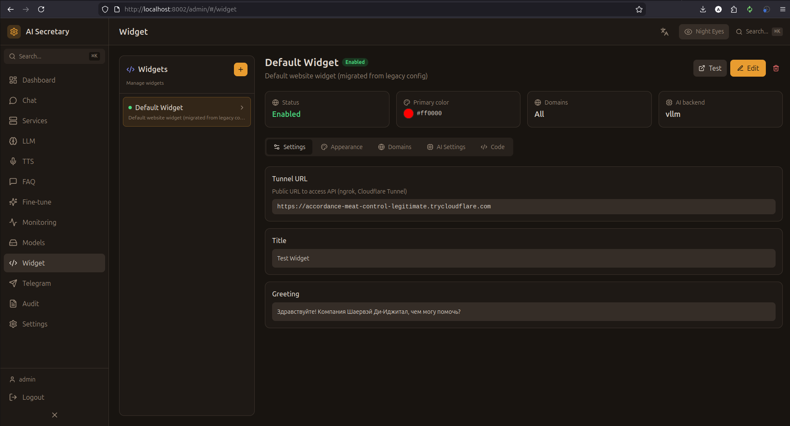

# Widget (Веб-виджеты)

Настройка чат-виджетов для встраивания на веб-сайты.

## Скриншот

<!-- Вставьте скриншот страницы Widget -->


## Концепция

Виджет — это чат-окно, которое можно встроить на любой сайт:
- Посетители сайта общаются с ИИ-ассистентом
- Все сообщения сохраняются в системе
- Можно настроить несколько виджетов для разных сайтов

## Список виджетов

| Колонка | Описание |
|---------|----------|
| **Название** | Имя виджета |
| **Домен** | Разрешённые домены |
| **Статус** | Активен / Отключен |
| **Сессий** | Количество чат-сессий |
| **Действия** | Настройки / Код / Удалить |

## Создание виджета

1. Нажмите "Создать виджет"
2. Введите название
3. Укажите разрешённые домены
4. Настройте внешний вид
5. Сохраните

## Настройки виджета

### Основные

| Параметр | Описание |
|----------|----------|
| **Название** | Отображаемое имя |
| **Домены** | Список разрешённых доменов |
| **Приветствие** | Первое сообщение бота |
| **Placeholder** | Текст в поле ввода |

### Внешний вид

| Параметр | Описание |
|----------|----------|
| **Позиция** | Угол экрана (bottom-right, bottom-left) |
| **Цвет** | Основной цвет виджета |
| **Размер** | Компактный / Стандартный / Большой |
| **Заголовок** | Текст в шапке виджета |
| **Аватар** | URL иконки бота |

### LLM настройки

| Параметр | Описание |
|----------|----------|
| **Backend** | vLLM / Gemini / Cloud provider |
| **Персона** | Выбор персоны |
| **System prompt** | Кастомный системный промпт |

## Код для встраивания

### Получение кода

1. Выберите виджет
2. Нажмите "Получить код"
3. Скопируйте код

### Пример кода

```html
<script>
  window.AiSecretaryWidget = {
    widgetId: 'widget_123456',
    baseUrl: 'https://your-server.com'
  };
</script>
<script src="https://your-server.com/widget/widget.js" async></script>
```

### Размещение

Вставьте код перед закрывающим тегом `</body>` на вашем сайте.

## Безопасность

### Ограничение доменов

Виджет работает только на разрешённых доменах:
- `example.com` — только этот домен
- `*.example.com` — все поддомены
- `*` — любой домен (не рекомендуется)

### Rate Limiting

- 10 сообщений в минуту на IP
- 100 сообщений в час на виджет
- Настраивается в конфигурации

## Аналитика

- **Сессии** — количество начатых чатов
- **Сообщения** — общее количество сообщений
- **Среднее время** — средняя длина сессии

Подробнее: [[Widget-Integration]]

---

← [[Models]] | [[Telegram]] →
